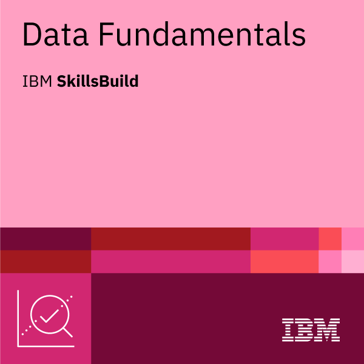
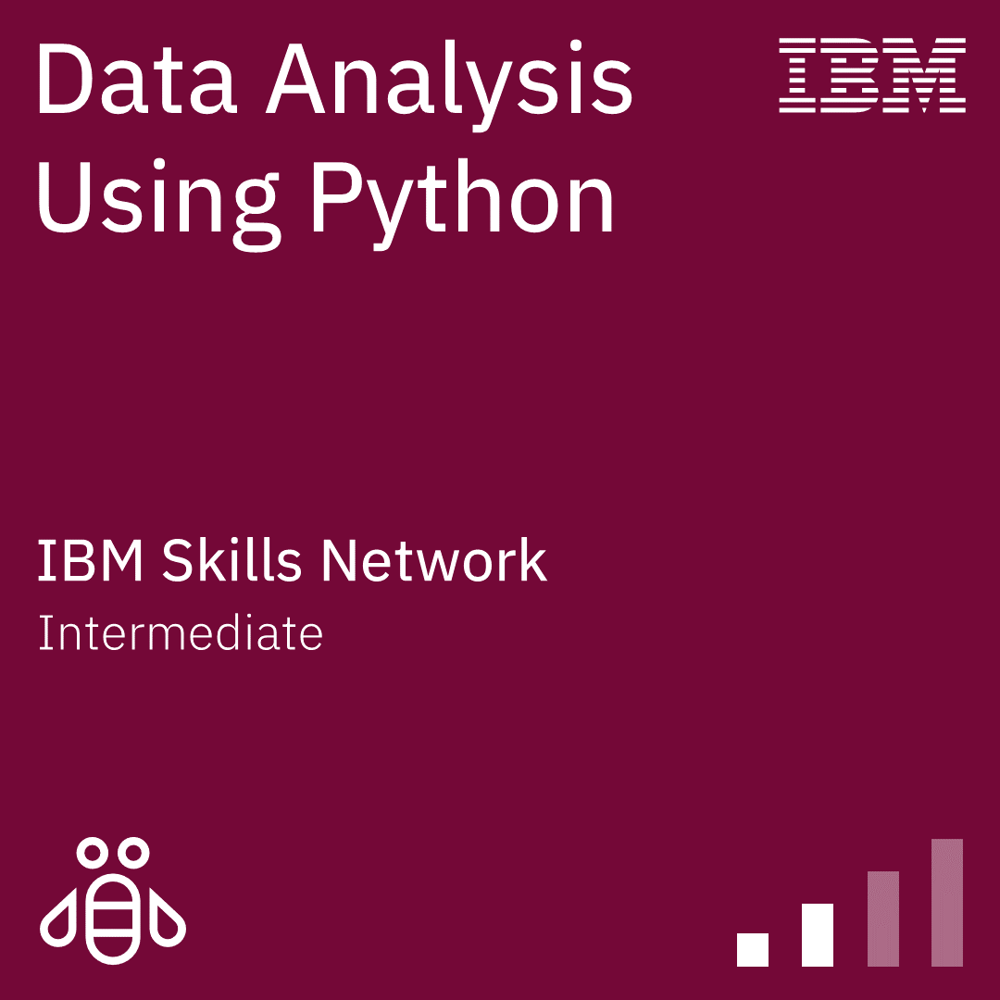

# Olá, eu sou o Victor!

### 🎓 Estudante de Engenharia da Computação na UTFPR

Sou um desenvolvedor apaixonado por **Backend** e **Engenharia de Software**, focado em construir soluções robustas e escaláveis. Atualmente, atuo também como professor de inglês.

---

### 🛠️ Tecnologias e Ferramentas

**Backend & Aplicações:**

**Dados & Infra:**

**Interesses de Estudo:**
* 🧠 Inteligência Artificial & Deep Learning
* 📊 Análise e Ciência de Dados
* 🏗️ Arquitetura de Software e Design Patterns

---

### 🚀 Projeto em Destaque

#### ☕ **Gestor TEDI**
*Aplicação Full Stack para gestão corporativa.*
* **Stack:** Java, Spring Boot, Docker.
* **Destaque:** Implementação de arquitetura MVC, Domain-Driven Design e containerização completa.

---

### 📊 Estatísticas do GitHub

  
  
   
  
  

---

### 🏆 Certificações

| Cisco JavaScript | IBM Data Fundamentals | IBM Python Analysis |
| :---: | :---: | :---: |
|  |  |  |

---

### 📫 Contato

